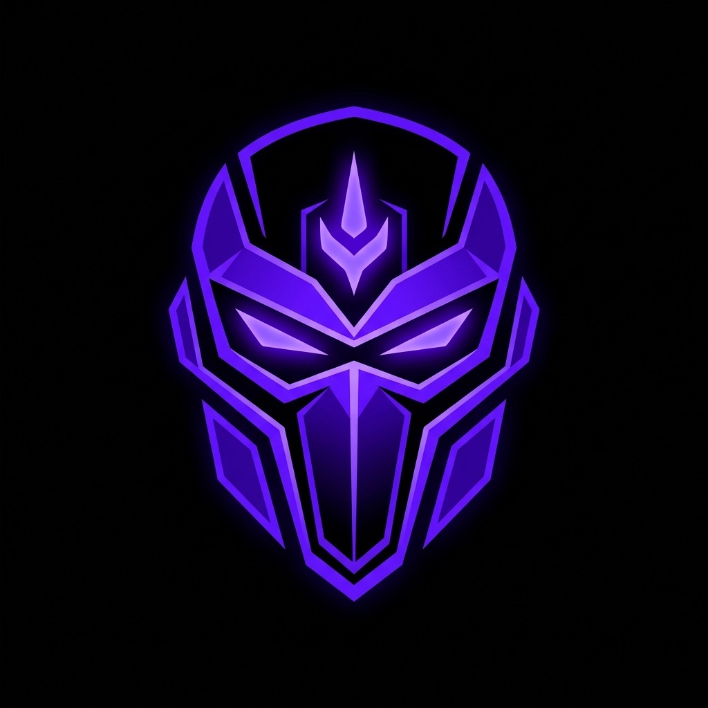
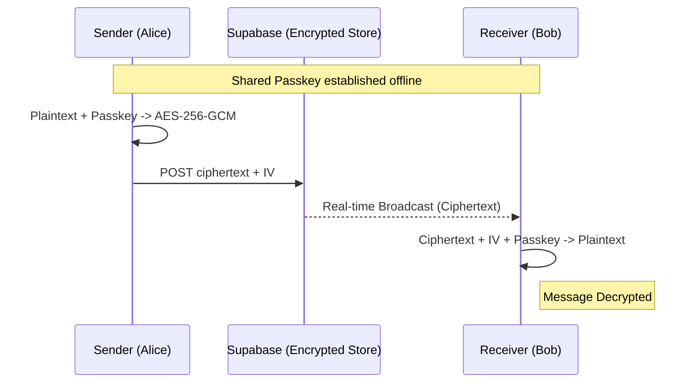

# <p align="center"><br>CIPHER</p>

<p align="center">
  <strong>Encrypted. Minimalist. Private.</strong><br>
  <em>The next-generation secure messaging platform built for the elite.</em>
</p>

<p align="center">
  
  
  
  
</p>

---

## 🔒 Zero-Trust Architecture

**Cipher** is engineered from the ground up with a zero-trust mindset. Unlike standard messaging apps, we never see your data. Your messages are encrypted long before they ever touch our infrastructure.

### The Security Stack
- **Web Crypto API**: Industry-standard high-performance primitives.
- **PBKDF2**: Key derivation with 100,000 iterations for bulletproof passkeys.
- **AES-256-GCM**: Military-grade symmetric encryption with random initialization vectors (IV) for every single message.
- **Zero-Log Store**: Our database only holds ciphertext. Without your local shared key, even our admins are blind.

---

## 🔥 Key Features

- **⚡ Real-time Pulse**: Instant message delivery using Supabase real-time event bus.
- **👥 Dynamic Groups**: Create, join, and manage private groups with shared encryption contexts.
- **🤖 Gemini AI Integration**: A secure AI relay for assistant-based queries within the app.
- **🌑 Stealth Mode UI**: A premium, high-contrast dark theme optimized for focused communication.
- **📱 PWA Ready**: Install Cipher directly to your home screen for a native, zero-friction experience.
- **⌨️ Discord-Style Interaction**: Familiar commands, typing indicators, and message grouping logic.

---

## 🛠️ Technical Overview

### Message Flow (E2EE)



### Folder Structure
- `frontend/`: React + Vite application (The Cipher Client).
- `database/`: SQL scripts for the Supabase schema and RLS policies.
- `backend_legacy/`: Archive of the legacy node-based backend.

---

## 🚀 Getting Started

1.  **Environment Setup**:
    - Copy `frontend/.env.example` to `frontend/.env`.
    - Populate with your Supabase credentials.
2.  **Install Dependencies**:
    ```bash
    cd frontend && npm install
    ```
3.  **Run Development**:
    ```bash
    npm run dev
    ```

---

## 🛡️ Security Best Practices

Cipher is a robust baseline for private communication. For production deployment, always ensure:
- **HTTPS Everywhere**: Mandatory for Web Crypto API.
- **Key Rotation**: Implement periodic passkey updates for maximum security.
- **HSTS**: High Security Transport Headers should be enabled on the server.

---

<p align="center">
  Developed with focus and precision by <strong>Antigravity</strong>.
</p>
