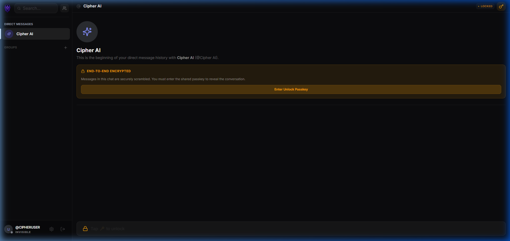
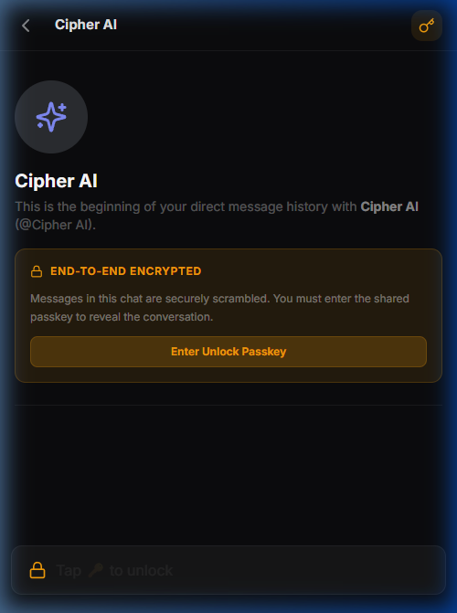

<div align="center">
  
  <h1>CIPHER</h1>

  <p><strong>ENCRYPTED. MINIMALIST. PRIVATE.</strong></p>
  <p><em>The definitive next-generation secure messaging platform for power users.</em></p>

  <p>
    
    
    
    
  </p>
</div>

---

## 📸 Showcase

### Desktop Experience


### Mobile & PWA
<p align="center">
  
</p>

---

## 🚫 The Problem: The Postcard
Using standard messaging apps (like Discord, Instagram, or standard server-relays) is exactly like sending a **postcard through the mail**. 
The postman, the delivery facility, and the corporate mailroom can simply flip it over and read every word. The companies hosting your chats hold the "master skeleton key" to your data. If their servers are breached, hacked, or compromised, all your private messages, photos, and histories are instantly exposed in plaintext to the public. 

## 🛡️ The Solution: The Titanium Lockbox
**Cipher** is completely different; it is a **Zero-Trust Messenger**. 
Using Cipher is like locking your message inside a **titanium safe** before handing it to the postman.
We (the app's infrastructure) transport the safe with lightning speed, but we are mathematically blind to what's inside. Only the true recipient—the friend who holds the exact identical key locally in their hands—can open it. 
Even if our entire remote database is stolen by a hacker tomorrow, all they get is a massive mountain of unbreakable titanium safes.

---

## 🔒 The Zero-Trust Architecture

**Cipher** is engineered from the ground up with an absolute zero-trust mindset. Unlike commercial messaging applications, we are mathematically blind to your data. Your messages, media metadata, and group semantics are rigorously encrypted client-side long before they ever touch our routing infrastructure.

### The Cryptographic Stack
- **Web Crypto API**: High-performance, native browser cryptographic primitives.
- **PBKDF2 Key Derivation**: Hardened passkey derivation leveraging 100,000 iterations to actively deter brute-force attacks.
- **AES-256-GCM**: Military-grade symmetric encryption delivering authenticated encryption. Every payload utilizes a randomized Initialization Vector (IV).
- **Stealth Data Store**: Our Supabase PostgreSQL infrastructure acts entirely as a dumb relay. It routes raw ciphertext. Without your local volatile decryption key, the data is useless entropy.

### 🧠 How Encryption Actually Works in Cipher
Cipher uses genuine **End-to-End Encryption (E2EE)**. This means your private communications are locked before they ever leave your screen. Here is how your data is handled:

1. **The Keys (Offline Agreement)**: You and your conversation partner securely agree on a secret passkey in real life or via another secure channel.
2. **The Vault (Encryption)**: The moment you hit send, your browser crushes that passkey through 100,000 algorithmic cycles (PBKDF2) to forge a master cryptographic key. It then uses **AES-256-GCM** to scramble your text, images, and GIFs into a completely unrecognizable matrix of characters.
3. **The Relay (Transit & Storage)**: This scrambled noise (Ciphertext) is dispatched to our cloud database. If a hacker, a government, or even our own server administrators intercept the data, they will only see absolute gibberish. **We do not have your keys. We cannot read your chats.**
4. **The Unlocking (Decryption)**: When your friend opens the app, their device pulls the scrambled data from the cloud. Their browser uses the exact same shared passkey to unlock and reveal the message locally.

*Zero stored passwords. Zero master skeleton keys. Total communication blackout to the outside world.*

---

## 🔥 Elite Feature Set

### 🛡️ Uncompromised Privacy
- **E2EE Media Sharing**: Share images, GIFs, and stickers with total confidence. Not just the files, but the file *metadata* (width, height, types) is fully encrypted.
- **Total Data Annihilation**: Implement true ephemeral messaging. Deleting a message chemically burns the payload from the remote Supabase database and storage buckets.

### ⚡ Lightning Fast UX
- **Chronological Dynamic Sorting**: The sidebar DM list intelligently auto-sorts in real-time. New messages instantly rocket conversations to the top of the stack.
- **Discord-Style Aesthetics**: Familiar interfaces, intelligent message grouping (stitching), glowing unread indicators, and a resilient dark mode.
- **PWA Grade Mobile Integration**: Installable to Android/iOS home screens. Features custom virtual back-button navigation hooks and aggressive heuristic overrides to prevent OS password managers from hijacking the chat inputs.

---

## 🛠️ Infrastructure & Tech Stack

- **Frontend Core**: React 18, Vite, TailwindCSS
- **Styling**: Modern dark-mode aesthetic with custom transitions and hardware-accelerated animations.
- **Engine**: Supabase (PostgreSQL, Realtime, Storage, Auth)
- **Encryption**: Browser-native Web Crypto API (AES-256-GCM & PBKDF2)
- **Deployment**: Optimized for high-performance Edge hosting.

---

## 🗺️ Roadmap (Coming Soon)

- [ ] **WebRTC Voice & Video**: Fully encrypted peer-to-peer calling.
- [ ] **Forward Secrecy**: Automatic session key rotation for maximum security.
- [ ] **Ephemeral Profiles**: Temporary identities that vanish after inactivity.
- [ ] **Message Reactions**: Securely encrypted emoji reactions to any message.

---

## 🚀 Deployment & Initialization

### Prerequisites
- Node.js (v18+)
- A Supabase Project (Database + Storage + Realtime)

### 1. Environment Configuration
Duplicate the secure template and inject your Supabase API keys:
```bash
cd frontend
cp .env.example .env
```

### 2. Ignite the Client
```bash
npm install
npm run dev
```

---

## ⚖️ License
Distributed under the **MIT License**. See `LICENSE` for more information.

<div align="center">
  <p>Built with uncompromising focus by <strong>Antigravity</strong>.</p>
</div>
